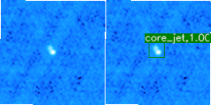
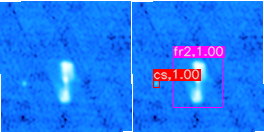

# HeTu-v1.0: radio source finding and classification with deep learning
We developed an improved Faster R-CNN based radio source detector named [HeTu]that automatically identifies and classifies radio sources with associated morphological information (label name, score and bounding box). HeTu is built on the pioneering work of [ClaRAN](https://github.com/chenwuperth/claran) and further employs a combined [ResNet](https://ui.adsabs.harvard.edu/abs/2015arXiv151203385H) and [FPN](https://arxiv.org/abs/1612.03144) network as the backbone network. A new morphology classification scheme more suitable for radio astronomy study (compact sources, Fanaroff-Riley type I, Fanaroff-Riley type II and core-jet sources) is adopted.

The new features in this project as follows:
+ Added new annotation data set, the new data category names are 'cs(compact source)', 'fr1(FRI)', 'fr2(FRII)', 'core_jet'
+ Support Data augmentation, including flipping (left and right, up and down), and arbitrary rotation, but it is outside the pipeline program
+ The backdone network support ResNet50-FPN and ResNet101-FPN.
+ Support multiple nodes multiple gpus to batch predict data sets in parallel.
+ Added source founding in batch predict, and output a TXT file, for extended sources includes following columns:
```
imagename,classname,score,box,peak(Jy),peak_x,peak_y,peak_ra,peak_dec
```
For CS soruces includes following columns:
```
imagename, classname, score, box, local_rms, peak_flux, err_peak_flux, int_flux, err_int_flux, ra,  
dec, major, err_major, minor, err_minor, pa, err_pa
```
+ Support gaussian fitting for CS sources
+ Added pascal voc evaluation calculation


## Dependencies
+ cuda 10.0; hdf5; openblas
+ Python 3.5+(recommend Anacond3(python 3.7)); opencv-python
+ TensorFlow >=1.5 but < 2.0
+ TensorPack: `pip install --upgrade git+https://github.com/tensorpack/tensorpack.git`
+ pycocotools: `pip install pycocotools`
+ Aegean: `pip install AegeanTools`
+ Pre-trained [ImageNet ResNet50 model](http://models.tensorpack.com/FasterRCNN/ImageNet-R50-AlignPadding.npz) and [ImageNet ResNet101 model](http://models.tensorpack.com/FasterRCNN/ImageNet-R101-AlignPadding.npz)
  from tensorpack model zoo
+ [DataSets](https://pan.baidu.com/s/1Urrn0GGDflcms1s8Rm7EDQ), Extracted code: yrkp, which needs to be organised as the following directory structure:
```
data/
  annotations/
    instances_trainD1new.json
    instances_testD1new.json
  trainD1new/
    FIRSTJ23*_logminmax_new*.png
  testD1new/
    FIRSTJ23*_logminmax_new*.jpg
```

## Usage
### Train:
This is tested on China SRC systeam GPU nodes 
```
python train.py --logdir $LOG_DIR --config \
        MODE_MASK=False MODE_FPN=True \
        DATA.BASEDIR=./data \
        BACKBONE.WEIGHTS=./weights/pretrained/ImageNet-R50-AlignPadding.npz \
        DATA.TRAIN=trainD1new DATA.VAL=testD1new \
        PREPROC.TRAIN_SHORT_EDGE_SIZE=600,600 \
        PREPROC.TEST_SHORT_EDGE_SIZE=600 \
        TRAIN.LR_SCHEDULE=20000,30000,40000 \
        DATA.CLASS_NAMES='cs','fr1','fr2','core_jet'
```
Submit train job on cluster
```
sbatch slurm_train_D1new.sh
```

### Inference:

To detect all radio sources on a D1new image (needs DISPLAY to show the outputs):
```
python train.py --predict /home/blao/rgz_resnet_fpn/data/testD1new/FIRSTJ170731.3+535955_logminmax_new.png  \
        --load /home/blao/hetu/train_log/10468/model-320000 \
        --config MODE_MASK=False MODE_FPN=True \
        DATA.BASEDIR=./data \
        BACKBONE.WEIGHTS=./weights/pretrained/ImageNet-R50-AlignPadding.npz \
        DATA.TRAIN=trainD1new DATA.VAL=testD1new \
        PREPROC.TRAIN_SHORT_EDGE_SIZE=600,600 \
        PREPROC.TEST_SHORT_EDGE_SIZE=600 \
        TRAIN.LR_SCHEDULE=20000,30000,40000 \
        TEST.RESULT_SCORE_THRESH_VIS=0.7 \
        TEST.RESULT_SCORE_THRESH=0.7 \
        DATA.NUM_CATEGORY=4 \
        DATA.CLASS_NAMES='cs','fr1','fr2','core_jet'
```
If the DISPLAY is not set, it will produce an PNG image under the current directory:

  



On the left is the original D1new image, and the detected sources are shown on the right.

### Bath predict 
```
sbatch slurm_batchpred_new.sh
```
## Citation  
If you benefit from this project, please cite our [paper](https://ui.adsabs.harvard.edu/abs/2021SciBu..66.2145L/abstract):
```
@ARTICLE{2021SciBu..66.2145L,
       author = {{Lao}, Baoqiang and {An}, Tao and {Wang}, Ailing and {Xu}, Zhijun and {Guo}, Shaoguang and {Lv}, Weijia and {Wu}, Xiaocong and {Zhang}, Yingkang},
        title = "{Artificial intelligence for celestial object census: the latest technology meets the oldest science}",
      journal = {Science Bulletin},
     keywords = {Astrophysics - Instrumentation and Methods for Astrophysics},
         year = 2021,
        month = nov,
       volume = {66},
       number = {21},
        pages = {2145-2147},
          doi = {10.1016/j.scib.2021.07.015},
archivePrefix = {arXiv},
       eprint = {2107.03082},
 primaryClass = {astro-ph.IM},
       adsurl = {https://ui.adsabs.harvard.edu/abs/2021SciBu..66.2145L},
      adsnote = {Provided by the SAO/NASA Astrophysics Data System}
}
```

## Acknowledgement  
The initial codebase was built on the awesome [ClaRAN](https://github.com/chenwuperth/claran) and [tensorpack](https://github.com/tensorpack/tensorpack) project. 
